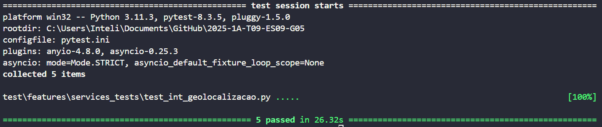

# Documentação de Integração - Geolocalização com OpenStreetMap (OSM) + Nominatim

## 1. Introdução

Esta documentação detalha a integração de um sistema de geolocalização baseado em OpenStreetMap (OSM) e Nominatim para busca de endereços e coordenadas geográficas. O objetivo é permitir a atualização da localização de entregadores e a seleção dos mais próximos a um ponto de entrega.

## 2. Estrutura da Integração

A estrutura da integração segue os seguintes componentes:

### 2.1. Camadas

- **Backend (Python + Firebase + Nominatim)**:
  - Atualiza a localização dos entregadores.
  - Busca entregadores disponíveis em um raio específico.
  - Obtém coordenadas a partir de um endereço.
  - Obtém endereço a partir de coordenadas.

### 2.2. Módulos e Serviços

- **Firebase Admin SDK**: Gerencia o banco de dados dos entregadores.
- **Geopy + Nominatim**: Fornece serviços de geocodificação e busca de endereços.
- **API OpenStreetMap (OSM)**: Base de dados utilizada pelo Nominatim.

### 2.3. Softwares

- **Banco de Dados Firebase**: Armazena a localização dos entregadores.
- **Bibliotecas Python**:
  - `firebase-admin` para interagir com o Firebase.
  - `geopy` para realizar consultas de geolocalização.
  - `time` para gerenciar intervalos de buscas.

## 3. Integração com OpenStreetMap (OSM) + Nominatim

### 3.1. O que é OpenStreetMap e Nominatim?

- **OpenStreetMap (OSM)** é um mapa de código aberto que fornece dados geoespaciais gratuitos.
- **Nominatim** é um serviço que permite buscar coordenadas a partir de um endereço e vice-versa, usando os dados do OSM.

### 3.2. Como foi adicionado ao código?

Foi implementado no backend um módulo que utiliza a biblioteca geopy para acessar o Nominatim e obter coordenadas ou endereços. O código foi inserido em um módulo separado para manter a organização.

#### Obter coordenadas a partir de um endereço:

```python
from geopy.geocoders import Nominatim

def obter_coordenadas(endereco: str):
    geolocator = Nominatim(user_agent="meu_app")
    localizacao = geolocator.geocode(endereco)
    
    if localizacao:
        return {"latitude": localizacao.latitude, "longitude": localizacao.longitude}
    else:
        return {"error": "Endereço não encontrado"}
```

## 4. Controle de Qualidade da Integração

### 4.1. Parâmetros de Qualidade

- **Tempo de Resposta**: As requisições devem ser respondidas em menos de 3 segundos.
- **Precisão**: As coordenadas retornadas devem estar dentro de uma margem de erro de 10 metros.
- **Versões**: O código utiliza a versão mais recente das bibliotecas.

### 4.2. Protocolos e Tratamento de Exceções

- **Erro de Endereço Não Encontrado**: Retornar `{"error": "Endereço não encontrado"}`.
- **Erro de Conexão**: Retentar a requisição até 3 vezes antes de falhar.

## 5. Fluxo de Integração

1. O entregador inicia o aplicativo e compartilha sua localização.
2. O backend atualiza a posição no Firebase.
3. O cliente insere um endereço para entrega.
4. O backend converte o endereço em coordenadas usando Nominatim.
5. O sistema busca os 3 entregadores mais próximos.
6. O entregador recebe a solicitação e aceita a entrega.
7. O sistema atualiza o status e envia uma mensagem de confirmação ao cliente.

## 6. Teste

### Como rodar os testes com Pytest

Para rodar os testes com o Pytest, você deve primeiro instalar o Pytest, se ainda não tiver feito isso, executando:

```bash
pip install pytest
```

Em seguida, crie um arquivo de configuração `pytest.ini` no diretório raiz do seu projeto com o seguinte conteúdo:

```ini
[pytest]
pythonpath = . src
```

Isso direciona o Pytest para o diretório src, onde o código está localizado, permitindo que ele encontre os módulos e pacotes necessários durante os testes.

Depois, para rodar os testes, execute o seguinte comando no terminal:

```
pytest
```

Isso irá executar todos os testes no projeto, procurando por funções de teste que começam com `test_`.

### 6.1. Explicação dos Testes Realizados

O código de teste utiliza o **Pytest** para testar as funções de geolocalização do sistema. Aqui está uma explicação detalhada de cada um dos testes:

### 6.1.1 Teste para a função `obter_coordenadas`
---

Este teste verifica se a função `obter_coordenadas`, que utiliza o **Nominatim** para obter coordenadas a partir de um endereço, está funcionando corretamente.

```python
import pytest

@pytest.mark.parametrize("endereco, esperado", [
    ("Avenida Paulista, São Paulo", True),
    ("Localização Inexistente XYZ", False)
])
def test_obter_coordenadas(endereco, esperado):
    resultado = obter_coordenadas(endereco)
    if esperado:
        assert "latitude" in resultado and "longitude" in resultado
    else:
        assert "error" in resultado
```

### Entradas e Resultados Esperados
---
- **Entrada 1**: Um endereço válido ("Avenida Paulista, São Paulo").
  - **Resultado Esperado**: O retorno deve conter as chaves `latitude` e `longitude`.

- **Entrada 2**: Um endereço inválido ("Localização Inexistente XYZ").
  - **Resultado Esperado**: O retorno deve conter a chave `error`.

A utilização do `@pytest.mark.parametrize` permite que o teste seja realizado com diferentes valores de entrada e resultados esperados.

### 6.1.2 Teste para a função `obter_endereco`
---

Este teste verifica se a função `obter_endereco`, que usa o **Nominatim** para converter coordenadas em um endereço, funciona corretamente.

```python
import pytest

@pytest.mark.parametrize("latitude, longitude, esperado", [
    (-23.561, -46.656, True),
    (0, 0, False)
])
def test_obter_endereco(latitude, longitude, esperado):
    resultado = obter_endereco(latitude, longitude)
    if esperado:
        assert "endereco" in resultado
    else:
        assert "error" in resultado
```

### Entradas e Resultados Esperados
---

- **Entrada 1**: Coordenadas válidas (latitude: -23.561, longitude: -46.656).
  - **Resultado Esperado**: O retorno deve conter a chave `endereco`.

- **Entrada 2**: Coordenadas inválidas (latitude: 0, longitude: 0).
  - **Resultado Esperado**: O retorno deve conter a chave `error`.

Novamente, o `@pytest.mark.parametrize` é usado para realizar o teste com entradas e saídas diferentes.

### 6.1.3 Teste para a função `atualizar_localizacao` no Firebase

---

Este teste verifica a função `atualizar_localizacao`, que atualiza a localização de um entregador no banco de dados Firebase.

```python
import pytest

@pytest.mark.asyncio
async def test_atualizar_localizacao():
    resposta = await atualizar_localizacao("entregador_123", -23.561, -46.656)
    assert resposta == {"message": "Localização atualizada"}
```

### Entradas e Resultados Esperados
---

- **Entrada**: ID do entregador ("entregador_123") e as coordenadas (-23.561, -46.656).
- **Resultado Esperado**: O retorno deve ser a mensagem `{"message": "Localização atualizada"}`.

O uso de `@pytest.mark.asyncio` permite que o teste funcione de forma assíncrona, já que a função `atualizar_localizacao` é uma função assíncrona.

## 7. Conclusão

<div align="center">
  <sub>Figura 01: Testes Aprovados</sub><br>
  <br>
  <sup>Fonte: Anna Aragão (2025)</sup>
</div>

Todos os testes realizados foram executados com sucesso, confirmando que as funções de geolocalização e atualização de localização no Firebase estão funcionando corretamente. A utilização do `@pytest.mark.parametrize` e `@pytest.mark.asyncio` permitiu testar diferentes cenários de maneira eficiente, tanto para funções síncronas quanto assíncronas. O sistema foi validado para garantir que as coordenadas e endereços sejam corretamente manipulados, e que as atualizações no banco de dados Firebase sejam realizadas conforme esperado.
