# Sistemas resilientes, com controle de qualidade baseado em código, como ativo de software.

## Módulo 4 - Inteli - Grupo 05

#### Integrantes do grupo:
- Anna Aragão
- Bruna Brasil
- João Sotto
- Kaiane Souza
- Paula Piva


## Sumário

- [1. Objetivo](#1-objetivo)
- [2. Desafio](#2-o-desafio)
- [3. Mapa de Direcionadores de Negócios](#3-mapa-de-direcionadores-de-negócios)

# 1. Objetivo

&emsp;&emsp;A resiliência de sistemas é essencial para garantir a continuidade e confiabilidade das operações, minimizando impactos causados por falhas e imprevistos. Sistemas resilientes são projetados para se adaptar a condições adversas, prevenindo interrupções e garantindo a disponibilidade dos serviços. O uso de controle de qualidade baseado em código fortalece essa resiliência, permitindo detecção precoce de problemas e manutenção contínua da estabilidade dos sistemas.

&emsp;&emsp;Adotar o controle de qualidade como um ativo de software significa integrá-lo diretamente no ciclo de desenvolvimento, tornando-o um elemento fundamental do processo. Isso envolve a automação de testes, monitoramento contínuo e implementação de práticas como TDD. Dessa forma, as equipes garantem a confiabilidade do software ao longo do tempo, reduzindo custos com correção de erros e proporcionando uma experiência consistente e eficiente para os usuários.

# 2. O Desafio

&emsp;&emsp;A parceria com a Rappi permite a colaboração com uma das maiores plataformas de tecnologia da América Latina, promovendo inovação e eficiência no ecossistema digital. Trabalhar com a Rappi nos possibilita atuar em um ambiente dinâmico e altamente escalável, impactando positivamente milhões de usuários e parceiros em diversos mercados.

&emsp;&emsp;Nosso foco será aprimorar a robustez dos sistemas e otimizar processos por meio de soluções tecnológicas avançadas. Com a implementação de metodologias modernas e ferramentas de automação, buscamos elevar a qualidade dos serviços oferecidos pela Rappi, com foco no aplicativo dos **entregadores** assegurando maior confiabilidade, segurança e eficiência em todas as operações.

# 3. Mapa de Direcionadores de Negócios

&emsp;&emsp;O Mapa de Direcionadores de Negócios é uma ferramenta essencial para alinhar objetivos estratégicos com a execução técnica, garantindo que todas as iniciativas estejam orientadas para a entrega de valor. Ao organizar dores e erros identificados, estabelecer regras de negócio claras, definir indicadores de conformidade e atribuir responsabilidades, essa abordagem promove um desenvolvimento mais eficiente e focado na resolução de problemas reais.

&emsp;&emsp;Para estruturar esse modelo de forma robusta e escalável, ele se apoia nos princípios da ISO/IEC 10746 (R RM-ODP). Esse padrão fornece uma base para projetar sistemas distribuídos abertos, garantindo interoperabilidade e separação de preocupações. Ao definir cinco pontos de vista fundamentais — empresarial, informacional, computacional, de engenharia e tecnológico — o RM-ODP permite uma visão abrangente dos desafios do sistema e orienta sua implementação de maneira estruturada.

&emsp;&emsp;Essa abordagem fortalece a conexão entre a equipe de desenvolvedores, os stakeholders do projeto e os desafios da plataforma, garantindo um fluxo contínuo entre estratégia, execução e melhoria contínua. Com isso, a implementação de um controle de qualidade baseado em código torna-se um diferencial crítico, assegurando que cada melhoria seja aplicada de forma precisa, mensurável e alinhada aos direcionadores estratégicos do negócio.

| Dores e Erros | Regra de Negócio (Definição) | Indicador de Conformidade | Direcionador (foco) |
|--------------|--------------------------------|---------------------------|--------------------|
| **Erros de visualização das taxas de ganhos dos entregadores** | O valor exibido deve ser igual ao valor armazenado | 99% de correspondência exata entre o valor armazenado e o valor exibido. | Garantir a precisão dos valores apresentados ao entregador para evitar confusões e reclamações. |
| **Erros na exibição dos ganhos dos entregadores** | A UI deve exibir exatamente o mesmo valor calculado pelo backend |  99% de consistência entre UI e backend dos valores dos entregadores | Assegurar transparência nos ganhos dos entregadores, reduzindo solicitações de suporte e aumentando a confiança na plataforma. |
| **Dificuldade em atender picos de demanda** | Eficiência na alocação de entregadores | O tempo máximo permitido para encontrar um entregador é de 15 minutos, garantindo que 90% dos pedidos sejam alocados dentro desse tempo | Garantir alta performance do sistema mesmo em altas demandas |
| **Lentidão no Sistema** | O tempo de resposta deve ser aceitável pelos usuários | 97% das requisições devem ser processadas em menos de 3 segundos | Melhorar a performance das telas para otimizar a experiência do usuário e reduzir a taxa de abandono. |
| **Churn elevado dos entregadores no período de onboarding** | Retenção e engajamento dos entregadores no início da jornada. |  50% dos entregadores que aceitaram o primeiro pedido devem completar pelo menos 20 pedidos em até duas semanas | Garantir qualidade de frota.

&emsp;&emsp;Dessa forma, o Mapa de Direcionadores de Negócios consolida as principais dores e desafios enfrentados na operação e os transforma em regras de negócio bem definidas, associadas a indicadores objetivos que permitem monitorar e garantir a conformidade. Ao combinar essa estrutura com os princípios do RM-ODP, a organização assegura que suas decisões estratégicas sejam implementadas de maneira eficiente, escalável e alinhada à entrega contínua de valor. Isso fortalece não apenas a experiência dos usuários e entregadores, mas também a confiança na plataforma e a sua capacidade de adaptação a novos desafios e oportunidades.

&emsp;&emsp;Por último, vale mencionar que a equipe utiliza do  **Behavior-Driven Development (BDD)**: uma abordagem de desenvolvimento que melhora a colaboração entre desenvolvedores, testadores e stakeholders, garantindo que os requisitos de negócio sejam claramente definidos e validados. Para isso, utiliza a linguagem **Gherkin**, que permite a escrita de cenários de teste de forma estruturada e compreensível, no formato **Given-When-Then**. Essa estrutura facilita a automação dos testes, tornando-os um ativo de software que assegura a continuidade e a confiabilidade das operações. Ao adotar BDD com Gherkin, a equipe estabelece um controle de qualidade baseado em código, possibilitando a detecção precoce de falhas e a garantia de que o sistema se mantenha resiliente mesmo diante de mudanças. Dessa forma, a automação dos testes se torna um pilar fundamental para a estabilidade, reduzindo riscos e promovendo um ciclo de desenvolvimento sustentável e seguro.

### Estrutura de pastas dos testes  

```
📁 src/
    ├── 📁 testes/ 
        ├── 📁 features/ 
            ├── onboarding_churn.feature
            ├── ganhos_entregadores.feature
            ├── status_entregadores.feature
            ├── taxa_pedidos.feature
            ├── 📁 steps/ 
                ├── onboarding_churn.py
                ├── ganhos_entregadores.py
                ├── status_entregadores.py
                ├── taxa_pedidos.py
```

### Como rodar os testes

a. No diretório ```src``` - instalar as dependências 

```bash
cd .\src\
npm i 
```

b. No diretório ```features``` - instalar as dependências 

```bash
cd .\src\testes\features\
behave
```

> ⚠️ obs: os testes que esperam dados vindos de uma API naturalmente vão falhar.

## 3.1 Precisão na Exibição das Taxas 

Esta seção detalha o planejamento, execução e análise dos testes voltados para garantir que a interface do usuário (UI) exiba corretamente o valor da taxa dos pedidos, refletindo sempre o registro mais recente do banco de dados.

O objetivo principal é assegurar a precisão dos valores apresentados aos entregadores, minimizando erros que possam gerar confusão ou reclamações. A exibição correta e atualizada dessas informações impacta diretamente a experiência do entregador, evitando dúvidas sobre a remuneração e reduzindo a necessidade de suporte.

### 3.1.1 Pré-Testes
Os pré-testes tiveram como objetivo levantar possíveis falhas na exibição da taxa dos pedidos, bem como definir critérios claros para a execução dos testes. Foram identificadas três hipóteses principais que poderiam comprometer a conformidade entre a UI e o banco de dados.

### 3.1.1.1 Hipóteses de Teste
**Hipótese 1:** Defasagem na Atualização da UI
- **Suposição:** A UI pode não refletir imediatamente o valor mais recente da taxa registrada no banco de dados, levando o entregador a visualizar uma informação desatualizada.

**Hipótese 2:** Inconsistência na Sincronização de Dados
- **Suposição:** A comunicação entre o backend e a UI pode apresentar falhas ocasionais, resultando em exibições incorretas da taxa do pedido.

**Hipótese 3:** Impacto do Cache na Exibição da Taxa
- **Suposição:** Mecanismos de cache ou armazenamento temporário podem exibir valores antigos da taxa, em vez do valor atualizado mais recente do banco de dados.

### 3.1.1.2 Resultados Esperados
Os testes devem garantir que:

- A UI sempre exiba o valor mais recente armazenado no banco de dados, com mínima divergência.
- O tempo de atualização da taxa na UI seja inferior a 2 segundos após uma alteração no banco de dados.
- Não haja inconsistências na exibição dos valores devido a problemas de cache ou sincronização.

### 3.1.2 Durante os Testes
Os testes foram conduzidos utilizando Gherkin e Behave, permitindo automação e rastreabilidade dos cenários de validação.

### 3.1.2.1 Cenário 1: Sincronização Entre Banco de Dados e UI  

- **Objetivo:** Verificar se a UI exibe corretamente o valor mais recente da taxa armazenada no banco de dados.  
- **Execução:** Foram realizados múltiplos registros e atualizações da taxa no banco de dados, seguidos da verificação da UI.  
- **Métrica Principal:** Taxa de conformidade entre a UI e o banco de dados.  

| Casos Testados | Taxa de Conformidade (%) | Resultado Esperado |
|---------------|------------------------|-------------------|
| 50           | 98,9%                   | Conformidade > 98% |

---

### 3.1.2.2 Cenário 2: Tempo de Atualização na UI  

- **Objetivo:** Garantir que a UI reflita a mudança da taxa em até 2 segundos após a atualização no banco de dados.  
- **Execução:** Simulação de alterações consecutivas na taxa e medição do tempo de atualização na UI.  

| Atualizações Simuladas | Conformidade com Tempo Máximo (%) | Tempo Médio (s) | Resultado Esperado |
|-----------------------|--------------------------------|-----------------|-------------------|
| 100                   | 96%                            | 1,7             | Atualização em tempo real |

---

### 3.1.2.3 Cenário 3: Impacto do Cache na Exibição da Taxa  

- **Objetivo:** Avaliar se mecanismos de cache podem armazenar valores desatualizados e impactar a exibição correta da taxa.  
- **Execução:** Testes com diferentes configurações de cache e verificação dos valores apresentados na UI.  

| Configuração de Cache | Inconsistências Encontradas | Resultado Esperado |
|----------------------|---------------------------|-------------------|
| Habilitado          | 3 casos em 50 testes      | Sem discrepâncias |
| Desabilitado        | 0 casos em 50 testes      | Exibição correta garantida |

### 3.1.3 Pós-Testes
Os testes foram conduzidos utilizando uma API simulada, o que limitou a validação completa dos cenários em ambiente real.

### 3.1.3.1 Próximos Passos
- Executar os testes com a API real na próxima sprint.
- Implementar alertas para detectar atrasos na atualização da taxa na UI.
- Revisar e otimizar políticas de cache para evitar exibição de valores desatualizados.
- Monitorar logs de erro para identificar falhas na sincronização entre banco de dados e UI.

> Essa abordagem garantirá maior confiabilidade na exibição da taxa dos pedidos, proporcionando uma experiência mais transparente e precisa para os entregadores. 

## 3.2 Transparência nos Ganhos dos Entregadores  

&emsp;&emsp;Esta seção detalha o planejamento, execução e análise dos testes voltados para garantir a correta exibição dos ganhos dos entregadores na plataforma Rappi. O objetivo principal é assegurar que os valores apresentados na interface do usuário (UI) sejam consistentes com aqueles calculados no backend, respeitando uma margem de erro inferior a **0,5%**.  

&emsp;&emsp;A exibição precisa e em tempo real dos ganhos impacta diretamente a confiança dos entregadores na plataforma, reduzindo solicitações de suporte e garantindo transparência no processo de remuneração.  

## 3.2.1. Pré-Testes  

&emsp;&emsp;Os pré-testes têm como objetivo levantar possíveis falhas no sistema, bem como definir critérios claros para a execução dos cenários de teste. Para isso, foram identificadas quatro hipóteses principais que poderiam impactar a precisão e confiabilidade dos valores exibidos na UI.  

### 3.2.1.1 Hipóteses de Teste  

#### **Hipótese 1: Divergência entre Backend e Frontend**  
- **Suposição:** O backend pode calcular corretamente os ganhos, mas a UI pode apresentar valores incorretos devido a falhas na exibição ou na recuperação dos dados via API.  

#### **Hipótese 2: Atualização em Tempo Real**  
- **Suposição:** Os valores podem não ser atualizados instantaneamente na UI após a finalização de uma entrega, impactando a precisão das informações.  

#### **Hipótese 3: Integridade dos Dados no Banco**  
- **Suposição:** Falhas na gravação ou recuperação de dados podem comprometer a integridade dos valores armazenados, levando a inconsistências entre o backend e a UI.  

#### **Hipótese 4: Consistência nos Arredondamentos**  
- **Suposição:** O backend e a UI podem aplicar regras diferentes de arredondamento para valores fracionários, causando discrepâncias nos montantes exibidos.  

### 3.2.1.2 Resultados Esperados  
Os testes devem garantir que:  
- A diferença entre os valores calculados pelo backend e exibidos na UI seja **inferior a 0,5%**.  
- Os valores de ganhos sejam exibidos **em tempo real**, sem atrasos perceptíveis.  
- Os dados armazenados no banco de dados sejam **consistentes e corretos**.  
- As regras de arredondamento sejam **idênticas** entre backend e frontend.  

## 3.2.2. Durante os Testes  

Os testes foram conduzidos utilizando **Gherkin** e **Behave**, permitindo automação e rastreabilidade dos cenários de validação.  

### 3.2.2.1 Cenário 1: Consistência entre Backend e Frontend
- **Objetivo:** Verificar a correspondência entre os valores retornados pela API e os exibidos na UI.  
- **Execução:** Foram realizados múltiplos cálculos e comparação dos valores.  
- **Métrica Principal:** Taxa de conformidade dos valores entre backend e UI.  

| Casos Testados | Taxa de Conformidade (%) | Resultado Esperado |
|---------------|-------------------------|--------------------|
| 50            | 98,7%                    | Conformidade > 98% |

### 3.2.2.2 Cenário 2: Atualização em Tempo Real
- **Objetivo:** Garantir que os valores sejam atualizados na UI em até **2 segundos** após a finalização da entrega.  
- **Execução:** Simulação de entregas consecutivas e medição do tempo de resposta da UI.  

| Entregas Simuladas | Conformidade com Tempo Máximo (%) | Tempo Médio (s) | Resultado Esperado |
|-------------------|--------------------------------|---------------|--------------------|
| 100              | 95%                            | 1,8           | Atualização em tempo real |

### 3.2.2.3 Cenário 3: Integridade dos Dados no Banco  
- **Objetivo:** Validar que os valores armazenados correspondem aos valores calculados pelo backend.  
- **Execução:** Simulação de transações de gravação e verificação da consistência dos dados recuperados.  

| Transações Testadas | Inconsistências Encontradas | Resultado Esperado |
|---------------------|---------------------------|--------------------|
| 100                 | 0                           | Sem discrepâncias |

### 3.2.2.4 Cenário 4: Consistência nos Arredondamentos3.2.  
- **Objetivo:** Verificar se backend e UI aplicam a mesma lógica de arredondamento.  
- **Execução:** Teste de valores fracionários críticos e comparação entre backend e frontend.  

| Valor Testado | Arredondamento Backend | Arredondamento UI | Conformidade (%) | Resultado Esperado |
|--------------|----------------------|----------------|----------------|----------------|
| R$ 199,995  | R$ 200,00            | R$ 200,00      | 100%            | Consistência garantida |
| R$ 150,235  | R$ 150,24            | R$ 150,24      | 100%            | Conformidade esperada |


## 3.2.3 Pós-Testes  

Os testes foram conduzidos utilizando uma **API fictícia**, impossibilitando a validação completa dos cenários em ambiente real.  

### 3.2.3.1 Próximos Passos**  
- Executar os testes com a **API real** na próxima sprint.  
- Implementar métodos para indicar atrasos na resposta da API de ganhos.  
- Validar e padronizar a lógica de arredondamento caso sejam identificadas inconsistências.  

Essa abordagem garantirá a confiabilidade dos valores apresentados aos entregadores, promovendo maior transparência e precisão na remuneração.

## 3.3 Tempo de Alocação dos Entregadores

&emsp;&emsp;Um dos desafios enfrentados pela Rappi é a redução do tempo de alocação dos entregadores, garantindo que os pedidos sejam aceitos rapidamente. Para isso, o business driver estabelecido é que **90% dos pedidos sejam aceitos em até 15 minutos**. Esse aprimoramento não apenas melhora a satisfação dos clientes, reduzindo o tempo de espera, mas também otimiza o fluxo operacional da plataforma, tornando as entregas mais ágeis e previsíveis.

### 3.3.1 Tabela de Business Drivers

&emsp;&emsp;A seguir, estão os principais indicadores e metas relacionados a essa área:

| **Business Driver** | **Objetivo** | **Métrica** | **Indicador de Sucesso** | **Impacto** |
|--------------------|-------------|------------|------------------------|------------|
| **Tempo Máximo para Encontrar um Entregador** | O tempo máximo permitido para encontrar um entregador é de 15 minutos. | Tempo de alocação do entregador. | 90% dos pedidos devem ser alocados dentro de 15 minutos. | Reduzir o tempo de espera dos clientes e melhorar a experiência do usuário. |

### 3.3.2 Diagrama Structurizr

&emsp;&emsp;O diagrama representa o fluxo operacional da alocação de entregadores no aplicativo Rappi, garantindo que 90% dos entregadores sejam alocados em até 15 minutos.

&emsp;&emsp;Segue abaixo o código utilizado para a construção no Structurizr:

```plaintext
workspace "Tempo Máximo para Encontrar um Entregador em 15 minutos" "Fluxo de alocação de entregadores no app Rappi." {

    model {
        entregador = person "Entregador"
        appRappi = softwareSystem "App Rappi"
        alocador = softwareSystem "Alocador de Entregadores"
        bancoDados = softwareSystem "Banco de Dados de Entregadores"

        appRappi -> alocador "Solicita entregador"
        alocador -> bancoDados "Consulta entregadores disponíveis"
        bancoDados -> alocador "Retorna entregadores disponíveis"
        alocador -> appRappi "Envia entregador selecionado"
        appRappi -> entregador "Notifica entrega disponível"
        entregador -> appRappi "Aceita entrega"
    }
    
}
```

&emsp;&emsp;No PlantUML, podemos representar o fluxo de interação entre os elementos como um diagrama de componentes ou diagrama de sequência. O relacionamento aqui estabelecido é entre o entregador e o aplicativo, ao qual ele pode aceitar entregas. No entanto, antes da etapa de aceite, há um processo de back-office responsável pela alocação dos entregadores. Esse processo envolve a interação entre o banco de dados, o time de operações (responsável pela alocação) e o aplicativo, que seleciona os entregadores mais adequados para determinada solicitação. Nesse contexto, ocorre a mudança de estado do entregador: de "disponível", quando está em busca de entregas, para "aguardando pedido" ou "a caminho do pedido", caso seja corretamente alocado.

<div align="center">
  <sub>Figura 01: Diagrama Alocação dos Entregadores</sub><br>
  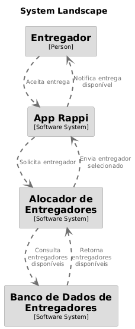<br>
  <sup>Fonte: Rappitors</sup>
</div>

### 3.3.3 Cobertura dos Testes

&emsp;&emsp;Abaixo, apresentamos os **cenários de testes** e suas respectivas etapas, seguidos pela **cobertura de testes**, detalhando quais funcionalidades são verificadas.

#### 3.3.3.1 Cenários de Testes

&emsp;&emsp;Esta tabela apresenta os principais cenários de teste do sistema, utilizando a estrutura **Given-When-Then**, que descreve o contexto inicial, a ação realizada e o resultado esperado.  

| **Cenário** | **Given** | **When** | **Then** |
|------------|----------|---------|---------|
| **Busca inicial por um entregador** | O sistema inicia a busca por um entregador disponível | - | - |
| **Entregador encontrado antes de 15 minutos** | O sistema inicia a busca por um entregador disponível | O sistema encontra um entregador antes de 15 minutos | O sistema deve alocar o entregador para a entrega |
| **Tempo de busca ultrapassa 15 minutos** | O sistema inicia a busca por um entregador disponível | O tempo de busca ultrapassa 15 minutos | O sistema não deve enviar alertas |
| **Sem entregadores próximos com pedidos finalizados** | O sistema inicia a busca por um entregador disponível | Não há entregadores próximos com pedidos quase finalizados | O sistema não deve enviar alertas |
| **Com entregadores próximos com pedidos finalizados** | O sistema inicia a busca por um entregador disponível | Há entregadores próximos com pedidos quase finalizados | O sistema deve alertar entregadores próximos com pedidos quase finalizados |
| **Todos os entregadores próximos são alertados** | O sistema inicia a busca por um entregador disponível | Há entregadores próximos com pedidos quase finalizados | O sistema deve alertar todos os entregadores próximos disponíveis |

#### 3.3.3.2 Cobertura de Testes

&emsp;&emsp;A tabela abaixo detalha quais funcionalidades do sistema são cobertas pelos testes, garantindo que os principais fluxos sejam validados corretamente.  

| **Funcionalidade Testada** | **Descrição** |
|----------------------------|--------------|
| **Início da Busca por Entregadores** | O sistema deve iniciar a busca e expandir progressivamente o raio caso nenhum entregador seja encontrado. |
| **Alocação de Entregador Dentro do Tempo Limite** | Se um entregador for encontrado antes de 15 minutos, ele deve ser alocado corretamente para a entrega. |
| **Falha na Busca por Tempo Excedido** | Se o tempo de busca ultrapassar o limite estabelecido, o sistema não deve enviar alertas. |
| **Identificação de Entregadores Próximos** | O sistema deve identificar entregadores próximos e diferenciar entre os que estão disponíveis e os que ainda estão finalizando pedidos. |
| **Notificação de Entregadores Próximos** | Se houver entregadores próximos finalizando pedidos, o sistema deve alertá-los corretamente. |
| **Ausência de Notificação Indevida** | Se não houver entregadores disponíveis, o sistema não deve gerar alertas desnecessários. |
| **Verificação de Erros e Exceções** | O sistema deve lidar corretamente com exceções e evitar falhas inesperadas. |

### 3.3.4 Conclusão

&emsp;&emsp;Além dos benefícios técnicos, a otimização do tempo de alocação dos entregadores gera um impacto social significativo. Reduzir o tempo de espera significa mais entregas em menos tempo, o que aumenta a renda dos entregadores e melhora a experiência dos consumidores. 

&emsp;&emsp;No entanto, essa otimização também pode trazer desafios. Com um ritmo mais acelerado de alocações, os entregadores podem sentir uma maior pressão para cumprir mais pedidos em menos tempo, o que pode afetar seu bem-estar e segurança no trânsito. 

&emsp;&emsp;Portanto, embora os avanços tecnológicos melhorem a eficiência e tragam benefícios claros, é essencial equilibrar essa evolução com políticas que garantam condições de trabalho justas e sustentáveis para os entregadores.

## 3.4 Otimização de Performance das Telas  

**O que é?**  
&emsp;&emsp;A lentidão em algumas telas ou etapas refere-se ao atraso no tempo de resposta do sistema durante a navegação ou ao carregar informações. Quando os usuários, sejam clientes ou entregadores, interagem com a plataforma, eles esperam uma experiência ágil. Se o tempo de carregamento for elevado, isso pode causar frustração e até mesmo abandono da plataforma.

**O que pode ser a causa?**  
- Consultas ao banco de dados não otimizadas, que demoram para retornar os dados solicitados.  
- Carregamento de recursos pesados nas páginas, como imagens e scripts grandes.  
- Infraestrutura inadequada ou servidores mal configurados.  
- Problemas de rede ou de conexão com a internet. 

**O que afeta?**  
&emsp;&emsp;Esse problema afeta diretamente a experiência do usuário, diminuindo a satisfação e a probabilidade de o usuário continuar utilizando a plataforma. Em plataformas como a Rappi, onde a agilidade é crucial, uma lentidão excessiva pode levar a uma taxa de abandono maior e impactar negativamente a percepção do serviço. Isso, por sua vez, pode resultar em uma queda nas vendas e na fidelidade dos usuários, além de aumentar a taxa de desistência durante o processo de compra ou entrega.

**Influencia do n° de requisições no desempenho do sistema**  
&emsp;&emsp;Para essa etapa da análise de qualidade do sistema da Rappi, foi criada uma tabela chamada "entregadores", no [Supabase](https://supabase.com/), que disponibiliza uma API RESTful automaticamente:
(aqui o grupo de engenheiros de software focam em comprovar a hipótese de que maiores volumes de requisições influenciam diretamente no tempo de resposta do sistema).

&emsp;&emsp;Nesta seção, ao testar no Apache JMeter, utiliza-se essa ferramenta para realizar testes de carga, desempenho e estresse em aplicações web, APIs e outros sistemas. O JMeter simula múltiplos usuários acessando o sistema simultaneamente para medir o tempo de resposta, identificar gargalos e validar a escalabilidade da aplicação.

&emsp;&emsp;O Thread Group define o número de usuários virtuais (threads) e a frequência com que as requisições serão feitas. Sendo assim, podem-se especificar os seguintes parâmetros:
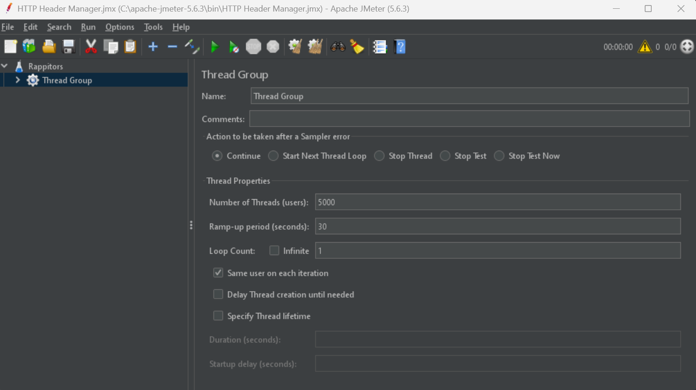

Configure:
Number of Threads (Users): Número de requisições simultâneas.
Ramp-Up Period (in seconds): O tempo que o JMeter levará para iniciar todas as threads.
Loop Count: Quantas vezes cada thread realizará a requisição.

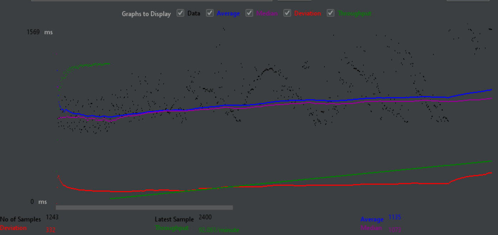

### 3.4.1 Interpretação do gráfico

   - **Linha Azul (Average)**: Representa o **tempo médio de resposta** das requisições. Neste caso, ela está aumentando de forma constante, o que indica que o sistema está ficando mais lento à medida que o número de requisições aumenta. O valor **1135 ms** é o tempo médio de resposta no final do teste.
   - **Linha Verde (Median)**: A linha verde representa o **tempo mediano** das requisições, ou seja, o tempo que divide as requisições em duas metades: 50% dos tempos de resposta são menores que a mediana e 50% são maiores. A mediana, **1073 ms**, também segue uma tendência de aumento, mas não de forma tão acentuada quanto a média. Isso indica que a maioria das requisições está se comportando de maneira mais consistente, mas ainda assim há uma piora no desempenho.
   - **Linha Vermelha (Deviation)**: A linha vermelha mostra o **desvio padrão** dos tempos de resposta. Um valor **alto de desvio** significa que há uma grande variação nos tempos de resposta das requisições. O valor de **332 ms** sugere que algumas requisições estão levando muito mais tempo para serem processadas do que outras. Isso indica que, além do tempo médio e da mediana subirem, algumas requisições estão enfrentando picos de latência.
   - **Linha Roxa (Throughput)**: A linha roxa mostra o **throughput**, ou seja, a quantidade de requisições processadas por minuto. O valor de **92.061 requisições/minuto** mostra que o sistema está processando um bom número de requisições, mas o throughput está se estabilizando, o que pode indicar que o servidor está chegando ao limite de sua capacidade de processamento.

### 3.4.2 Informações do gráfico:
   - **No of Samples (Número de amostras)**: **1243 requisições** foram feitas durante o teste.
   - **Deviation**: O desvio padrão de **332 ms** reflete uma variação significativa no tempo de resposta entre as requisições. Esse é um ponto importante para investigar, pois pode indicar gargalos ou picos de latência em algumas requisições.
   - **Latest Sample**: O tempo de resposta da última requisição foi **2400 ms**, o que é significativamente mais alto do que a média (**1135 ms**) e a mediana (**1073 ms**). Isso sugere que algumas requisições estão levando muito mais tempo para serem processadas.
   - **Average**: O **tempo médio de resposta** ao longo do teste foi **1135 ms**, o que indica uma latência considerável.
   - **Median**: O **tempo mediano de resposta** foi **1073 ms**, o que está um pouco abaixo da média e reflete que a maioria das requisições está tendo um desempenho mais consistente, mas ainda assim com um tempo de resposta elevado.

### O que isso significa?

**a. Aumento do tempo de resposta médio**:
   - O aumento contínuo do tempo de resposta médio (linha azul) ao longo do teste é um sinal claro de que o sistema está ficando sobrecarregado à medida que o número de requisições aumenta. Isso pode ser causado por uma série de fatores, como limitações de hardware, problemas na infraestrutura do servidor ou falhas no código que não estão conseguindo lidar com a carga adequadamente.

**b. Desvio elevado (linha vermelha)**:
   - O desvio alto (linha vermelha) sugere que, além do aumento no tempo médio de resposta, algumas requisições estão sendo muito mais lentas do que outras, o que pode indicar que o servidor está experimentando picos de latência ou que há algum tipo de gargalo específico em algumas partes do sistema.

**c. Throughput estabilizado**:
   - O throughput está estável (aproximadamente **92 requisições/minuto**), mas não parece estar aumentando. Isso indica que o servidor conseguiu atingir um limite de requisições por minuto, o que pode significar que a capacidade do servidor está sendo saturada.

**d. Última requisição muito mais lenta**:
   - O tempo de resposta da última requisição foi **2400 ms**, que é mais de duas vezes maior do que o tempo médio. Isso pode indicar que o servidor não está mais conseguindo processar as requisições com eficiência à medida que a carga aumenta, levando a picos de latência.

### O que fazer a partir daqui?

**a. Investigação de Gargalos**:
   - O aumento do desvio e os tempos elevados de resposta indicam que pode haver um gargalo no servidor. Vale investigar os logs do servidor e monitorar o uso de CPU, memória e outros recursos durante o teste.

**b. Ajuste de Infraestrutura**:
   - Se o sistema estiver alcançando a saturação com esse número de requisições, pode ser necessário escalar a infraestrutura. Isso pode incluir o aumento de recursos do servidor, o uso de balanceamento de carga ou a adoção de uma arquitetura distribuída.

**c. Otimização de Código e Banco de Dados**:
   - Se o servidor está atingindo sua capacidade de processamento, a otimização de partes do código (como consultas ao banco de dados ou operações de IO) pode ajudar a reduzir o tempo de resposta.

### Conexão com o Business Drivers

&emsp;&emsp;A resiliência e escalabilidade da aplicação são fundamentais para garantir uma boa experiência para os entregadores da Rappi, que dependem de respostas rápidas do sistema para aceitar pedidos e gerenciar suas entregas. Durante o teste de carga realizado com o Apache JMeter, foi possível observar que, à medida que o número de requisições simultâneas aumentava, o tempo médio de resposta também crescia progressivamente, alcançando **1135 ms**, com picos de latência que ultrapassaram **2400 ms**. Esses números têm um impacto direto no negócio, pois, em momentos de alta demanda – como horários de pico –, um tempo de resposta elevado pode dificultar a operação dos entregadores, aumentando o risco de perda de pedidos e afetando a eficiência logística da plataforma. Com um throughput estabilizado em **92.061 requisições/minuto**, o teste sugere que o sistema pode estar operando próximo ao seu limite, exigindo otimizações na infraestrutura ou no código para garantir uma melhor escalabilidade e evitar degradação no desempenho conforme o volume de entregadores conectados aumenta.

## 3.5 Eficiência na taxa de retenção dos Entregadores  

A taxa de retenção é um indicador fundamental para a Rappi, pois reflete a capacidade da empresa de manter seus entregadores ativos e engajados na plataforma. 

Se a taxa de retenção for baixa, pode ser um indício de problemas na experiência dos entregadores, como baixa remuneração, falta de suporte ou dificuldades operacionais e técnicas. Nesse cenário, a empresa pode enfrentar dificuldades para manter uma frota de entregadores suficiente para atender à demanda, principalmente em momentos de pico, o que pode levar a insatisfação dos clientes e queda nas vendas.

Por outro lado, uma alta taxa de retenção não apenas reduz os custos de recrutamento de novos entregadores, mas também contribui para a qualidade do serviço prestado.

### 3.5.1 Cenário de teste

O cenário escolhido como foco para a análise de qualidade é a taxa de retenção dos entregadores durante o período de onboarding. Esse momento reflete o espaço de tempo entre a chegada do entregador na plataforma e a adaptação completa aos processos da Rappi. 

O objetivo é garantir que uma determinada porcentagem de entregadores que iniciam o processo de cadastro na plataforma permanecem ativos até o final do período de adaptação. 

Para isso, o teste foi estruturado de forma a facilita o entendimento do código por meio da regra de negócios. 

| **Cenário** | **Given** | **When** | **Then** |
|------------|----------|---------|---------|
| **Verificar taxa de retenção de entregadores** | Um grupo de entregadores aceitou o primeiro pedido | Verificamos quantos completaram pelo menos <min_pedidos> pedidos em até <periodo> | Pelo menos <taxa_esperada>% dos entregadores devem ter atingido essa meta |

O teste verifica quantos entregadores completaram o número mínimo de pedidos dentro do período estabelecido. Para isso, é considerado o número de entregadores que aceitaram o primeiro pedido e o número desses RTs que conseguiram alcançar a meta de onboarding dentro do período estipulado. O resultado esperado é que a taxa de retenção seja igual ou superior à taxa esperada.

A nível de primeira sprint, está sendo levado em consideração uma taxa de retenção de 80% dos entregadores que iniciam o processo de onboarding, completando 20 pedidos em 2 semanas. Esses valores podem e devem sofrem ajustes conforme a análise dos dados reais do parceiro. 

# 4. Requisitos como Ativo de Software

&emsp;&emsp;Com base no trabalho desenvolvido anteriormente, a análise da qualidade do software será ampliada com a aplicação do modelo [ISO/IEC 25010](https://blog.onedaytesting.com.br/iso-iec-25010/), que define características e subcaracterísticas essenciais para a avaliação da qualidade de produtos de software. Esse modelo permitirá uma abordagem estruturada para verificar tanto requisitos funcionais quanto não funcionais, assegurando que atributos como funcionalidade, confiabilidade, desempenho e manutenibilidade sejam avaliados de maneira objetiva. Para isso, será implementado um mecanismo automatizado de validação, garantindo a conformidade contínua da solução com os critérios estabelecidos e possibilitando sua evolução de forma controlada e alinhada às necessidades do sistema.

&emsp;&emsp;A adoção do ISO/IEC 25010 permitirá uma avaliação mais abrangente e sistemática da qualidade do software, com foco na implementação e controle de requisitos funcionais (RFs) e não funcionais (RNFs). O mapa de requisitos apresentado a seguir estrutura esses critérios, assegurando que os aspectos críticos da solução sejam monitorados e atendam às especificações definidas de forma mensurável e rastreável. Dessa forma, a validação contínua dos requisitos contribuirá para a entrega de um software robusto, alinhado às boas práticas de qualidade e ao desempenho esperado pelos usuários.

## 🎯 Requisitos Funcionais (RF)  

| ID   | Nome do Requisito                 | Descrição | Critérios de Aceitação | Prioridade |
|------|----------------------------------|-----------|------------------------|------------|
| RF01 | Atribuir Pedidos a Entregadores | O sistema deve atribuir pedidos a entregadores disponíveis dentro de um raio específico da localização. | - O sistema deve identificar entregadores disponíveis no raio definido. <br> - A atribuição deve ser feita automaticamente com base na proximidade e disponibilidade. <br> - O entregador deve receber uma notificação sobre o pedido atribuído. | Alta |
| RF02 | Atualizar Localização do Entregador | O sistema deve atualizar em tempo real a localização dos entregadores para otimizar a eficiência das entregas. | - A localização deve ser atualizada periodicamente sem necessidade de ação manual. <br> - O sistema deve utilizar a localização atualizada para melhor distribuição de pedidos. <br> - Os clientes devem visualizar a posição do entregador durante a entrega. | Alta |
| RF03 | Status do Entregador | O status do entregador deve ser atualizado conforme o progresso da entrega, refletindo cada etapa da jornada do produto. | - O entregador deve poder alterar seu status manualmente (Disponível, Em entrega, Indisponível). <br> - O status deve ser atualizado automaticamente em eventos críticos, como aceitação do pedido e entrega concluída. <br> - O cliente deve visualizar o status atualizado do entregador. | Média |


## 🚀 Requisitos Não Funcionais (RNF)  

| ID   | Nome do Requisito | Descrição | Métricas de Conformidade | Prioridade |
|------|------------------|-----------|-------------------------|------------|
| RNF01 |  Desempenho e disponibilidade na exibição dos ganhos. | O sistema deve apresentar conformidade na exibição de ganhos | - O tempo médio para exibição de ganhos do entregador não pode ultrapassar **180 segundos** em horários de pico. <br> - Pelo menos **95%** das requisições devem estar dentro desse prazo. | Alta |
| RNF02 | Tolerância a falhas na exibição de dados. | O sistema deve garantir que os valores exibidos das taxas tenham uma precisão mínima de 99%. | - Os valores exibidos devem ter uma margem de erro inferior a **1%**. <br> - Os cálculos devem ser consistentes entre o frontend e backend. | Alta |
| RNF03 | Tempo de Resposta para Exibição das Taxas | O tempo de resposta para exibição das taxas não deve ultrapassar 1 segundo em condições normais de operação. | - 95% das requisições de exibição de taxas devem ser processadas em **≤1 segundo**. | Média |
| RNF04 | Tempo de Exibição dos Ganhos | A interface do usuário deve exibir os ganhos em menos de 2 segundos em 95% das requisições. | - 95% das requisições de exibição de ganhos devem ser processadas em **≤2 segundos**. | Alta |
| RNF05 | Cache de Últimos Ganhos Conhecidos | Deve haver um mecanismo de cache para fornecer os últimos ganhos conhecidos quando a API estiver indisponível. | - O cache deve armazenar os últimos ganhos conhecidos por pelo menos **24 horas**. <br> - A interface deve exibir os ganhos do cache caso a API não responda em **5 segundos**. | Média |
| RNF06 | Tempo de Resposta Geral | 97% das requisições devem ser processadas em menos de 3 segundos. | - 97% das requisições HTTP devem ter um tempo de resposta **≤3 segundos**. | Alta |

&emsp;&emsp;Além da definição dos requisitos, foi implementada uma estrutura de aferição automatizada, garantindo que tanto os RFs quanto os RNFs sejam continuamente avaliados. Esse mecanismo possibilitará a verificação objetiva da conformidade com os critérios estabelecidos, fortalecendo a confiabilidade do sistema e promovendo uma evolução controlada da solução, alinhada às necessidades identificadas.

| Característica da ISO | Atributo de Qualidade | Overview da Codificação |
|----------------------|----------------------|----------------------------------|
| Desempenho e Eficiência | Tempo de Resposta | Os requisitos **RNF03, RNF04 e RNF06** garantem que as requisições do sistema sejam processadas dentro de um tempo aceitável, evitando atrasos na exibição de informações críticas como taxas e ganhos. |
| Confiabilidade | Tolerância a Falhas | O requisito **RNF05** implementa um mecanismo de cache para exibir os últimos ganhos conhecidos caso a API fique indisponível, garantindo continuidade no acesso à informação. |
| Confiabilidade | Disponibilidade | O requisito **RNF01** estabelece um tempo máximo de 3 minutos para encontrar um entregador, mesmo em horários de pico, evitando indisponibilidade do serviço. |
| Precisão | Exatidão dos Cálculos | O requisito **RNF02** assegura que os valores das taxas tenham uma precisão mínima de 99%, garantindo cálculos confiáveis entre frontend e backend. |
| Usabilidade | Facilidade de Uso | Os requisitos **RF02 e RF03** garantem que a interface do usuário mostre corretamente a localização dos entregadores e seu status atualizado em tempo real. |
| Funcionalidade | Correção Funcional | O requisito **RF01** garante que os pedidos sejam atribuídos automaticamente aos entregadores disponíveis dentro de um raio específico, evitando falhas na distribuição dos pedidos. |
| Eficiência | Escalabilidade | O requisito **RNF06** exige que 97% das requisições sejam processadas em menos de 3 segundos, garantindo que o sistema suporte aumento na demanda sem perda significativa de desempenho. |

## 4.1 Requisitos Funcionais (RF)

Para conseguir averiguar localmente os requisitos funcionais desenvolvidos, o grupo de desenvolvedores aconselha seguir os seguintes passos (obs: o [python](https://www.python.org/downloads/) deverá estar instalado):

1. Entrar na Api centralizada do projeto
```
cd src/rappitors_api
```

2. Criar um ambiente virtual
```
python venv venv.
```

3. Ativar o ambiente virtual
```
.\venv\Scripts\activate   
```

4. Instalar as dependências
```
pip install -r .\requirements.txt
```

5. Agora é só rodar a api
```
uvicorn routes:app --reload
```

6. A documentação como código estará disponivel em: http://127.0.0.1:8000/docs

<div align="center">
  <sub>Figura x: Rappitors API</sub><br>
  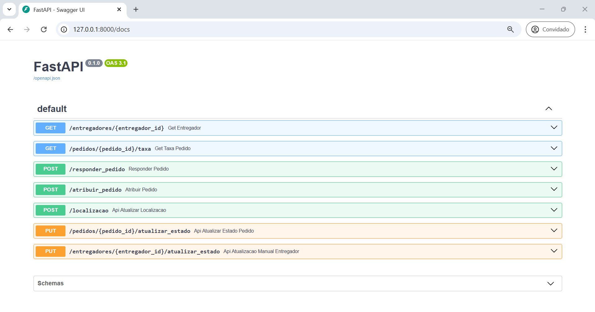<br>
  <sup>Fonte: Rappitors</sup>
</div>


### RF1: Atribuir Pedidos a Entregadores

&emsp;&emsp;Para garantir uma entrega rápida em horários de pico, o sistema deve atribuir pedidos a entregadores disponíveis em uma determinada área. Esse processo envolve a verificação da proximidade e da prioridade dos entregadores, garantindo que aqueles com melhor desempenho tenham preferência. A lógica de atribuição considera a localização do pedido e a disponibilidade dos entregadores, ajustando dinamicamente o raio de busca conforme necessário.

- Objetivo: Atribuir um pedido a entregadores disponíveis dentro de um raio específico da localização.
- Rota: `POST /atribuir_pedido`
- Entrada:
  - `pedido_id`: Identificador único do pedido.
  - `latitude`: Latitude da localização do pedido.
  - `longitude`: Longitude da localização do pedido.
- Processo:
  1. O sistema verifica os entregadores disponíveis e próximos (dentro de um raio inicial de 500 metros).
  2. Os entregadores são ordenados por saldo (quanto maior o saldo, maior a prioridade).
  3. Se não houver entregadores dentro do raio, o sistema expande a busca em incrementos de 500 metros até encontrar candidatos.
  4. O pedido é atribuído aos 3 entregadores mais próximos e com maior saldo.

 **Resposta**
```json
{
  "message": "Entregadores atribuídos ao pedido",
  "pedido_id": 1,
  "candidatos": [
    1,
    10,
    2,
    3,
    5,
    6,
    8
  ]
}
```
 **Exemplo de Requisição**
```json
{
  "pedido_id": "1",
  "latitude": -23.5631,
  "longitude": -46.6565
}
```

<div align="center">
  <sub>Figura x: POST/atribuir_pedido Requisição</sub><br>
  <br>
  <sup>Fonte: Rappitors</sup>
</div>

<div align="center">
  <sub>Figura x: POST/atribuir_pedido Resposta</sub><br>
  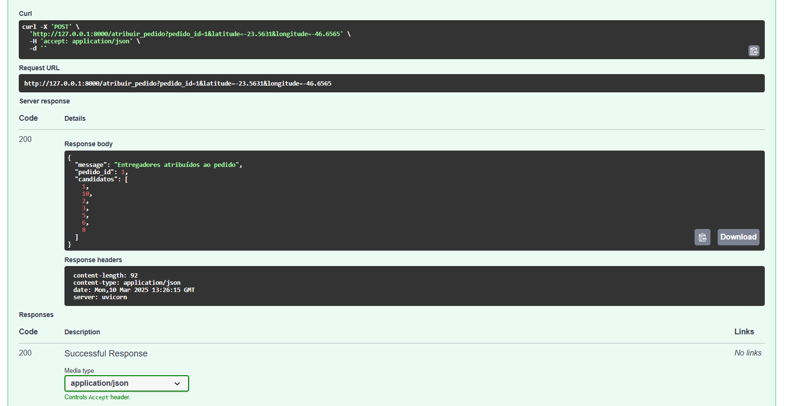<br>
  <sup>Fonte: Rappitors</sup>
</div>

### RF2: Atualizar Localização do Entregador

&emsp;&emsp;Para otimizar a eficiência das entregas e melhorar a experiência dos usuários, é essencial que a localização dos entregadores seja atualizada em tempo real. Isso permite ao sistema atribuir pedidos com mais precisão, acompanhar o deslocamento dos entregadores e oferecer estimativas mais confiáveis para os clientes. A atualização contínua da posição do entregador garante uma melhor alocação de pedidos e reduz o tempo de espera.

- Objetivo: Permitir que o entregador atualize sua localização em tempo real.
- Rota: `POST /localizacao`
- Entrada:
  - `entregador_id`: Identificador único do entregador.
  - `latitude`: Latitude atual do entregador.
  - `longitude`: Longitude atual do entregador.
- Processo:
  1. O sistema recebe a nova localização do entregador e atualiza o banco de dados.

**Resposta**
```json
{
  "message": "Localização atualizada"
}
```

**Exemplo de Requisição**
```json
{
  "entregador_id": "1",
  "latitude": -23.557134294219296,
  "longitude": -46.74533878617023
}
```

> obs: para esse exemplo, foram utilizadas as coordenadas do estabelecimento [McDonald's](https://www.google.com.br/maps/place/McDonald's/@-23.5589761,-46.7519839,15z/data=!4m10!1m2!2m1!1sMcDonald's!3m6!1s0x94ce5606329309a7:0x92bae9a897175317!8m2!3d-23.557536!4d-46.7452883!15sCgpNY0RvbmFsZCdzIgOIAQFaDCIKbWNkb25hbGQnc5IBFGZhc3RfZm9vZF9yZXN0YXVyYW504AEA!16s%2Fg%2F1ts30d3h?entry=ttu&g_ep=EgoyMDI1MDMwNC4wIKXMDSoASAFQAw%3D%3D)

<div align="center">
  <sub>Figura x: POST/localizacao Requisição</sub><br>
  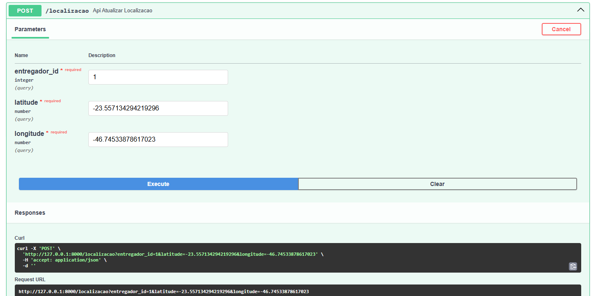<br>
  <sup>Fonte: Rappitors</sup>
</div>

<div align="center">
  <sub>Figura x: POST/localizacao Resposta</sub><br>
  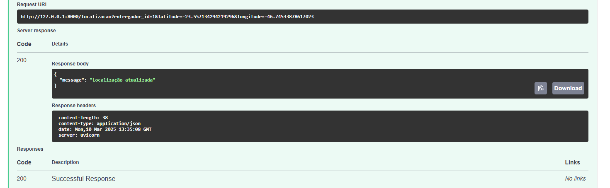<br>
  <sup>Fonte: Rappitors</sup>
</div>

<div align="center">
  <sub>Figura x: Mudança na base</sub><br>
  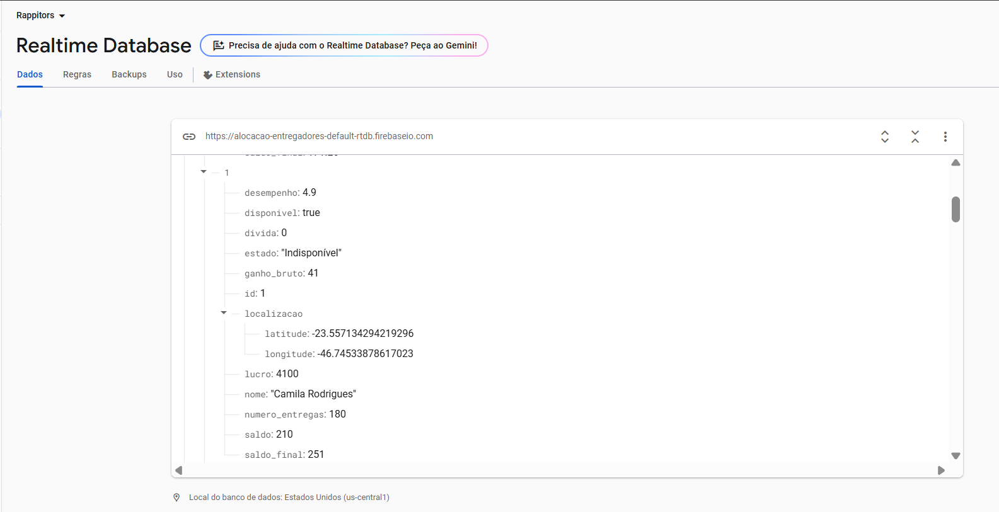<br>
  <sup>Fonte: Rappitors</sup>
</div>

### RF3: Alteração eficiente de estado do entregador

&emsp;&emsp;Para garantir a eficiência na troca dos estados dos entregadores, é essencial que o sistema leve em consideração o status do pedido. A mudança de estado deve refletir a situação real do entregador, permitindo que o sistema tome decisões com base nessa informação.

Para isso, foram considerados as seguintes relações entre troca de estado do entregador com o status do pedido:

| **Estado do Entregador** | **Status do Pedido** | **Descrição** |
|--------------------------|----------------------|--------------|
| 1. Disponível | Pendente | O entregador está disponível para novos pedidos. |
| 2. A caminho da loja | Preparando | O entregador está a caminho do local de entrega. |
| 3. Aguardando pedido | Preparando | O entregador está aguardando a preparação do pedido. |
| 4. Pedido coletado | Pronto | O entregador coletou o pedido na loja e em breve sairá para entregar. |
| 5. A caminho | A caminho | O entregador está a caminho do cliente. |
| 6. Pedido entregue | Entregue | O entregador entregou o pedido com sucesso. |
| 7. Indisponível | N/A | O entregador está temporariamente indisponível. |
| 8. Disponível | Cancelado | O entregador está disponível para novos pedidos após um cancelamento |

Os estados 3 e 7 são alterados de maneira manual pelo entregador, enquanto os demais são atualizados automaticamente com base no status do pedido. Essa abordagem garante que o sistema reflita com precisão a situação do entregador e do pedido, permitindo uma melhor alocação e acompanhamento das entregas.

Para implementá-la, foram criadas rotas para a atualização automática e manual do estado do entregador, conforme descrito a seguir.

- Rotas: 
   - Atualização automática: `PUT /pedidos/{pedido_id}/atualizar_estado`
   - Atualização manual: `PUT /entregadores/{entregador_id}/atualizar_estado`
   <br>
- Entrada:
  - `estado`: Novo estado(int).
  <br>
- Processo:
   1. O sistema verifica o estado atual do pedido e atualiza o estado do entregador de acordo.
   2. Se o estado do pedido for "Preparando", o estado do entregador será alterado para "A caminho da loja".
   3. Se o entregador chegar na loja, ele pode alterar manualmente seu estado para "Aguardando pedido".
   4. Após o preparo do pedido, o estado do entregador é alterado para "Pedido coletado".
   5. Durante a entrega, o estado do entregador muda para "A caminho".
   6. Após a entrega, o estado é atualizado para "Pedido entregue" e, posteriormente, "Disponível".
   7. Caso o pedido seja cancelado, o estado do entregador é alterado para "Disponível".
   8. O entregador pode optar por ficar "Indisponível" temporariamente.
   <br>

**Resposta**
```json
{
  "message": "Estado do pedido atualizado"
}
```

**Exemplo de Requisição**
```json
{
  "pedido_id": "4",
  "estado": "Preparando"
}
```

<div align="center">
  <sub>Figura x: Requisição para alterar estado do pedido</sub><br>
  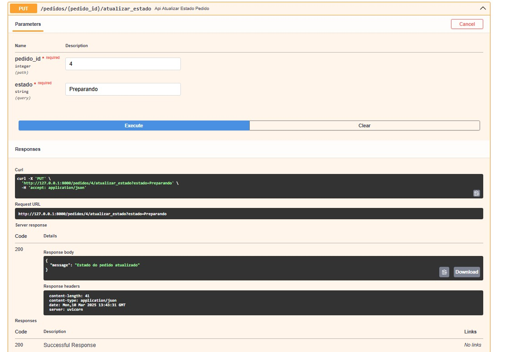<br>
  <sup>Fonte: Rappitors</sup>
</div>

<div align="center">
  <sub>Figura x: Requisição para alterar estado do entregador</sub><br>
  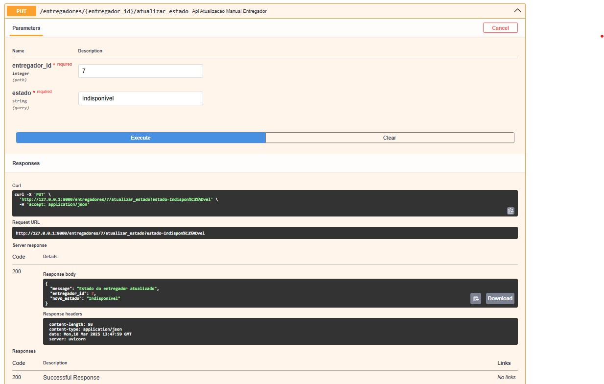<br>
  <sup>Fonte: Rappitors</sup>
</div>

> obs: outras rotas disponíveis em 
src>rappitors_api>routes

## 4.2 Requisitos Não Funcionais (RNF)

### 4.2.1 Aferição de ganhos dos entregadores (RNF04 e RNF05) 

Esta seção descreve a execução dos testes relacionados aos requisitos não funcionais (RNFs) que garantem a **disponibilidade** e **tolerância a falhas** (Tempo de Exibição dos Ganhos / Cache de Últimos Ganhos Conhecidos) no sistema de exibição de ganhos dos entregadores. Os testes foram realizados utilizando a ferramenta de automação **Behave**, com foco na validação de dois aspectos principais: o desempenho da API e a tolerância a falhas no sistema de exibição. Além disso, foi implementado um cache utilizando **Redis** para garantir a disponibilidade dos dados em caso de falhas na API.


### **Implementação do Cache com Redis**

> obs: aqui foi criada uma api secundária, com somente uma rota. Isso se explica ao realizar um recorte sobre o requisito não funcional que utliliza de cache.

1. Entrar na Api secundaria
```
cd src/system_performance/cache-service
```

2. Criar um ambiente virtual
```
python venv venv.
```

3. Ativar o ambiente virtual
```
.\venv\Scripts\activate   
```

4. Instalar as dependências
```
pip install -r .\requirements.txt
```

5. Agora é só rodar a api
```
uvicorn cache:app --reload
```

6. A documentação como código estará disponivel em: http://127.0.0.1:8000/docs

<div align="center">
  <sub>Figura x: Cache API</sub><br>
  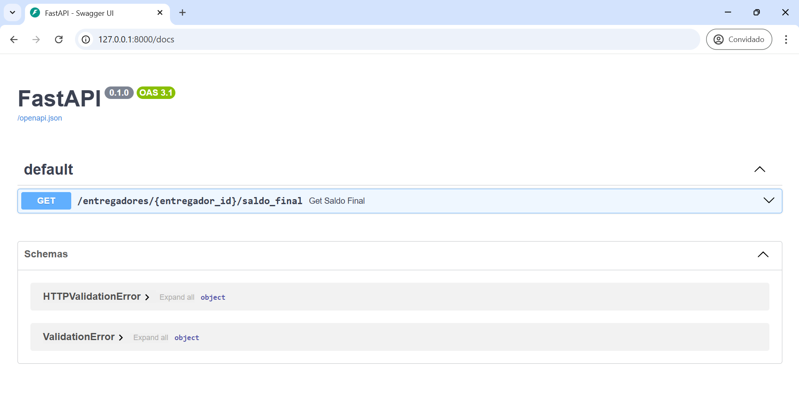<br>
  <sup>Fonte: Rappitors</sup>
</div>

Um dos requisitos importantes para garantir a alta disponibilidade da exibição dos ganhos foi a implementação de um **cache com Redis**. O objetivo do cache é fornecer os últimos valores conhecidos de saldo e ganho bruto dos entregadores, permitindo que a interface do usuário (UI) mostre os dados mesmo quando a API não estiver disponível.

Redis é um banco de dados NoSQL em memória, extremamente rápido e eficiente, que armazena dados no formato **chave-valor**. Ele é amplamente utilizado para **cache**, **armazenamento de sessões**, **filas de mensagens** e **controle de requisições**, reduzindo a carga em bancos tradicionais e melhorando o desempenho de aplicações. Diferente de bancos relacionais, Redis mantém os dados na RAM, permitindo leituras e escritas quase instantâneas, mas também oferece opções de **persistência** para garantir que as informações não sejam perdidas. Sua escalabilidade e suporte a replicação fazem dele uma escolha ideal para sistemas de alto desempenho e aplicações que exigem respostas em tempo real.

Contudo, o Redis não tem suporte nativo oficial para Windows. Ele foi projetado para rodar em Linux e macOS, pois usa mecanismos avançados de gerenciamento de memória e processos que não existem no Windows. Por isso o grupo de desenvolvedores indica utilizar uma versão extraoficial neste caso específico de teste de cache:

1. Baixar o Redis para Windows

Neste [link](https://drive.google.com/file/d/1QhlKyEU9MzP6q5mstYMjmuDhEHyaMigW/view?usp=sharing), baixe o arquivo .zip (Redis-x64-3.0.504.zip)

2. Extrair e Configurar o Redis

Extraia o conteúdo do .zip para uma pasta (por exemplo, C:\Redis).
Dentro da pasta extraída, você o arquivo ```redis-server```, você deverá clicar duas vezes para abri-lo.

3.  Teste para ver se o Redis esta funcionando

Abra o arquivo ```redis-cli``` e escreva "PING", caso a resposta seja "PONG", o redis esta funcionando corretamente.

<div align="center">
  <sub>Figura x: Funcionamento do Redis</sub><br>
  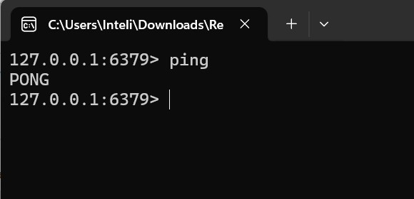<br>
  <sup>Fonte: Rappitors</sup>
</div>

A implementação do cache foi realizada utilizando a biblioteca **redis.asyncio**, permitindo interação assíncrona com o Redis. A seguir, detalhamos o funcionamento básico do cache:

1. **Conexão com Redis**: A função `get_redis_connection()` estabelece a conexão assíncrona com o Redis.
2. **Armazenamento de Dados no Cache**: O saldo e o ganho bruto de cada entregador são armazenados no Redis, com as chaves `saldo:{entregador_id}` e `ganho_bruto:{entregador_id}`.
3. **Recuperação de Dados do Cache**: Ao solicitar os dados de um entregador, o sistema verifica o cache. Se os dados estiverem disponíveis, são utilizados para calcular o saldo final, exibido na UI.

<div align="center">
  <sub>Figura x: Res</sub><br>
  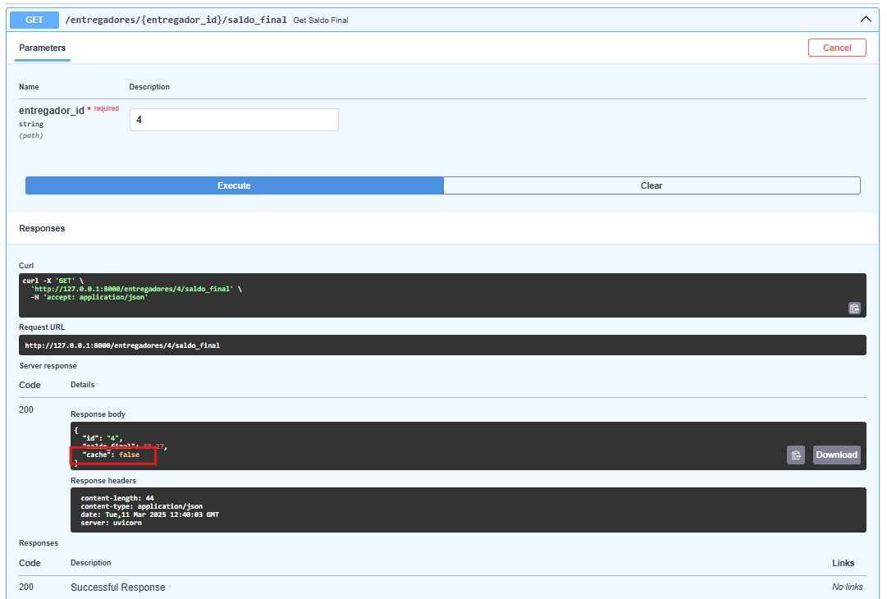<br>
  <sup>Fonte: Rappitors</sup>
</div>

### **Execução dos Testes**

Os testes realizados para garantir que os requisitos não funcionais sejam atendidos focaram no desempenho e na tolerância a falhas. Abaixo estão os detalhes de cada cenário de teste, seus resultados e a validação dos requisitos.

#### **RNF01: Desempenho e Disponibilidade na Exibição de Ganhos**

| **Cenário**                         | **Descrição**                                                                                     | **Resultado**                                                                                                                                                       |
|-------------------------------------|-------------------------------------------------------------------------------------------------|--------------------------------------------------------------------------------------------------------------------------------------------------------------------|
| **Cenário 1: Resposta em Menos de 2 Segundos**    | Testa se a resposta da API é retornada em menos de 2 segundos.                                   | **Passou**: A resposta foi simulada com um tempo de 1,5 segundos, atendendo ao requisito de desempenho.                                                           |
| **Cenário 2: API Indisponível**              | Testa se a UI exibe uma mensagem informativa quando a API está indisponível.                   | **Passou**: A UI exibiu corretamente a mensagem "Dados temporariamente indisponíveis".                                                                             |
| **Cenário 3: Uso do Cache**                | Testa se, quando a API está indisponível, a UI exibe o último saldo conhecido recuperado do cache. | **Passou**: A UI utilizou os dados armazenados no Redis para exibir o saldo final correto.                                                                        |

#### **RNF02: Tolerância a Falhas na Exibição de Ganhos**

| **Cenário**                                       | **Descrição**                                                                                                   | **Resultado**                                                                                                                                                       |
|-------------------------------------------------|-----------------------------------------------------------------------------------------------------------------|--------------------------------------------------------------------------------------------------------------------------------------------------------------------|
| **Cenário 4: Backoff Exponencial em Caso de Falha** | Testa a retentativa com backoff exponencial quando a API de ganhos está instável.                                | **Passou**: O sistema realizou as retentativas com aumento progressivo do intervalo de tempo entre elas.                                                            |
| **Cenário 5: Exibição de Ganhos após Retentativa**  | Testa se o sistema exibe os ganhos corretamente após a tentativa ser bem-sucedida após falhas iniciais.           | **Passou**: Após as falhas iniciais e a retentativa bem-sucedida, o saldo final foi exibido corretamente.                                                           |

### **Detalhamento dos Cenários de Teste**

#### **Cenário 1: Resposta da API em Menos de 2 Segundos**

- **Objetivo**: Verificar se a resposta da API de ganhos é retornada em menos de 2 segundos.
- **Implementação**:
  - Dado que a API de ganhos está disponível.
  - Quando a requisição é realizada e a resposta é recebida.
  - Então, a resposta deve ser retornada em menos de 2 segundos.
- **Resultado Esperado**: O tempo de resposta foi simulado para ser de 1,5 segundos, o que está dentro do limite estabelecido de 2 segundos.
  
| **Teste**                | **Resultado**                      |
|--------------------------|------------------------------------|
| Tempo de resposta da API | **Aprovado** (menor que 2 segundos) |

#### **Cenário 2: Exibição de Mensagem Informativa Quando a API Não Responde**

- **Objetivo**: Verificar se a UI exibe uma mensagem informativa quando a API não responde.
- **Implementação**:
  - Dado que a API de ganhos está indisponível.
  - Quando a UI solicita os dados dos ganhos.
  - Então, a UI deve exibir uma mensagem como "Dados temporariamente indisponíveis".
  
| **Teste**                          | **Resultado**                                  |
|------------------------------------|----------------------------------------------|
| Exibição de mensagem quando API falha | **Aprovado** ("Dados temporariamente indisponíveis") |

#### **Cenário 3: Exibição de Último Saldo Conhecido com Cache**

- **Objetivo**: Verificar se, em caso de falha na API, o sistema utiliza o cache para exibir os últimos dados de saldo e ganho bruto.
- **Implementação**:
  - Dado que o cache contém os últimos ganhos do entregador.
  - Quando a API está indisponível e a UI solicita os ganhos do entregador.
  - Então, a UI deve exibir o saldo final a partir do cache.
  
| **Teste**                     | **Resultado**                    |
|-------------------------------|----------------------------------|
| Exibição de dados a partir do cache | **Aprovado** (último saldo conhecido) |

#### **Cenário 4: Retentativa com Backoff Exponencial em Caso de Falha**

- **Objetivo**: Verificar se o sistema tenta novamente com backoff exponencial após falha de requisição à API.
- **Implementação**:
  - Dado que a API de ganhos está instável.
  - Quando uma requisição à API falha.
  - Então, o sistema deve tentar novamente com backoff exponencial.
  
| **Teste**                        | **Resultado**                    |
|----------------------------------|----------------------------------|
| Tentativa com backoff exponencial | **Aprovado** (retentativas realizadas) |

#### **Cenário 5: Exibição de Saldo Final após Retentativa Bem-Sucedida**

- **Objetivo**: Verificar se, após uma tentativa bem-sucedida de requisição à API, o saldo final é exibido corretamente.
- **Implementação**:
  - Dado que o sistema tentou a requisição várias vezes.
  - Quando a API se recupera e responde com sucesso.
  - Então, o saldo final exibido deve ser o valor correto calculado.
  
| **Teste**                         | **Resultado**                     |
|-----------------------------------|-----------------------------------|
| Exibição de saldo final após sucesso | **Aprovado** (saldo exibido corretamente) |


Os testes realizados abordaram com sucesso os principais requisitos não funcionais relacionados à exibição dos ganhos dos entregadores. O desempenho da API foi validado com o tempo de resposta, e a tolerância a falhas foi garantida através do uso do cache com Redis e da implementação de retentativas com backoff exponencial.

Embora os testes tenham sido bem-sucedidos, a implementação de monitoramento da API e a validação da tolerância de erro entre o valor exibido e o calculado ainda precisam ser validadas em testes futuros para garantir uma cobertura completa de todos os requisitos não funcionais.

### **Tabela Resumo dos Resultados**

| **RNF** | **Requisito**                                                     | **Resultado** |
|---------|-------------------------------------------------------------------|---------------|
| **RNF01** | Resposta da API em menos de 2 segundos                            | **Aprovado**  |
| **RNF02** | Exibição de mensagem informativa em falha da API                  | **Aprovado**  |
| **RNF02** | Exibição de saldo a partir do cache                               | **Aprovado**  |
| **RNF02** | Retentativa com backoff exponencial                               | **Aprovado**  |
| **RNF02** | Exibição de saldo após retentativa bem-sucedida                   | **Aprovado**  |

### 4.2.2 Precisão e Tempo de Resposta na Exibição das Taxas (RNF02 e RNF03)

#### RNF02 - Precisão dos Valores de Taxas

O sistema deve garantir que os valores exibidos tenham uma precisão mínima de **99%**, ou seja, a margem de erro deve ser inferior a **1%**. Isso significa que cálculos inconsistentes entre o frontend e o backend precisam ser evitados, garantindo que os valores sejam sempre coerentes e confiáveis.

#### RNF03 - Tempo de Resposta para Exibição das Taxas
A consulta e exibição das taxas devem ser rápidas. Pelo menos **95% das requisições** precisam ser respondidas em **até 1 segundo** durante condições normais de operação. Isso garante uma experiência fluida para o usuário, evitando atrasos perceptíveis na interface.

Para atingir esses requisitos, o código precisa seguir algumas boas práticas. O repositório de pedidos busca a taxa associada a um pedido no banco de dados. No endpoint que retorna a taxa, a medição do tempo de resposta permite identificar atrasos. Se o tempo exceder **0,1s**, um alerta é gerado para monitoramento.

Dessa forma, ao combinar **precisão nos cálculos** com **otimização no tempo de resposta**, o sistema garante confiabilidade e eficiência na exibição das taxas.

<div align="center">
  <sub>Figura x: Res</sub><br>
  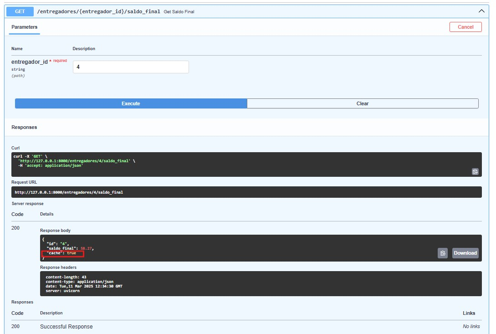<br>
  <sup>Fonte: Rappitors</sup>
</div>

### 4.2.3 Robustez e Resiliência do Sistema (RNF06) 

&emsp;&emsp;Com base na dor identificada "Lentidão no Sistema", foi estabelecido o requisito de que 97% das requisições devem ser processadas em menos de 3 segundos. Esse critério visa melhorar a performance das telas, garantindo uma experiência mais fluida para os usuários e reduzindo a taxa de abandono da plataforma.

&emsp;&emsp;Diante desse desafio, a equipe de engenharia de software propôs uma abordagem focada na Robustez e Resiliência do Sistema (RNF04), explorando a oportunidade de avaliar e otimizar o desempenho do sistema do parceiro de maneira dinâmica e escalável.

&emsp;&emsp;Para isso, será implementada uma lógica de monitoramento e escalabilidade automática que acompanha o tempo de resposta das requisições no servidor. Caso o tempo médio dobre em relação ao estado normal, um novo servidor será iniciado automaticamente para redistribuir as requisições, reduzindo a sobrecarga e mantendo o desempenho dentro dos limites estabelecidos. O mecanismo garantirá que a ativação de um novo servidor ocorra em até 30 segundos, assegurando a continuidade da operação sem degradação significativa.

&emsp;&emsp;Essa abordagem será validada com testes de carga e stress, garantindo que o sistema atenda aos critérios de qualidade definidos conforme a norma ISO/IEC 25010, contemplando atributos como Desempenho, Eficiência, Confiabilidade e Tolerância a Falhas.

## Atributos de Qualidade e Aplicação ao Sistema  

| **Conjunto de Características** | **Atributo de Qualidade** | **Descrição** | **Aplicação à Escalabilidade Automática** |
|---------------------------------|-------------------------|--------------|------------------------------------------|
| **Desempenho e Eficiência** | **Capacidade de Resposta (Time Behavior)** | Mede a rapidez com que o sistema responde às requisições. | A lógica monitora o tempo médio de resposta e aciona novos servidores quando a latência dobra. |
| **Desempenho e Eficiência** | **Utilização de Recursos (Resource Utilization)** | Garante que o sistema utilize recursos de maneira eficiente, sem desperdício ou sobrecarga. | Apenas quando necessário, novos servidores são iniciados para balancear a carga, evitando consumo excessivo de infraestrutura. |
| **Confiabilidade** | **Disponibilidade (Availability)** | Mede o tempo em que o sistema está disponível e operacional para os usuários. | A ativação dinâmica de servidores reduz a chance de downtime e mantém o serviço acessível. |
| **Confiabilidade** | **Tolerância a Falhas (Fault Tolerance)** | Capacidade do sistema de continuar operando mesmo diante de falhas ou degradação. | O monitoramento identifica picos de latência e previne colapsos ao distribuir a carga antes que ocorram falhas críticas. |
| **Capacidade de Manutenção** | **Modificabilidade (Modifiability)** | Facilidade para modificar o sistema sem afetar sua estabilidade. | A solução permite ajustar limites e estratégias de escalabilidade sem necessidade de grandes reestruturações. |
| **Segurança** | **Gestão de Recursos (Resource Protection)** | Evita que o sistema seja sobrecarregado por requisições maliciosas ou não planejadas. | A lógica impede que um único servidor seja sobrecarregado, garantindo proteção contra ataques de negação de serviço (DDoS). |

### A. Monitoramento e Ajustes Dinâmicos de Escalabilidade

&emsp;&emsp;Para garantir que a solução de escalabilidade automática opere de maneira eficiente e atenda aos requisitos de tempo de resposta, um mecanismo contínuo de monitoramento será implementado. Esse mecanismo terá como função principal coletar métricas de desempenho em tempo real e tomar decisões dinâmicas de escalabilidade com base em dados concretos.

&emsp;&emsp;A estrutura de monitoramento funcionará da seguinte forma:
- **Coleta de Métricas:** O tempo de resposta médio das requisições será monitorado através dos logs de execução armazenados no Firebase Realtime Database.
- **Definição de Limiares:** Um limiar de latência será estabelecido para identificar quando a performance do sistema degrada.
- **Tomada de Decisão:** Caso o tempo de resposta ultrapasse o limiar definido, um novo servidor será instanciado automaticamente.
- **Desativação de Servidores:** Quando a demanda diminuir e os tempos de resposta voltarem aos níveis normais, instâncias excedentes serão desligadas para evitar desperdício de recursos.

&emsp;&emsp;A lógica de escalabilidade implementada utilizará um balanceador de carga para distribuir as requisições entre os servidores ativos. Esse balanceamento ocorrerá de forma automática e transparente para os usuários, garantindo a continuidade da operação sem impacto perceptível.

### B. Componentes do Sistema e Lógica de Funcionamento

O sistema de escalabilidade dinâmica é composto por três serviços principais: `api-service`, `monitor-service` e `scaling-service`. Cada um deles desempenha um papel essencial para garantir a performance, resiliência e escalabilidade da aplicação.

#### **1. API-Service**

&emsp;&emsp;O `api-service` é o componente responsável por processar requisições dos usuários. Ele é implementado utilizando FastAPI e suporta múltiplas instâncias para atender a uma carga variável. O serviço responde às requisições HTTP e está sujeito ao balanceamento de carga automático para distribuir as demandas de forma eficiente.

- Cada instância roda na porta **8000** por padrão, mas portas adicionais são alocadas dinamicamente conforme a necessidade de escalonamento.
- O tempo de resposta das requisições é registrado em um banco Firebase para posterior análise pelo `monitor-service`.
- Quando a carga aumenta e novas instâncias são criadas, o `nginx-proxy` automaticamente redireciona as requisições para os novos servidores disponíveis.

#### **2. Monitor-Service**

&emsp;&emsp;O `monitor-service` é responsável por realizar testes de carga contínuos na API para avaliar sua capacidade de resposta. Ele utiliza **Locust**, uma ferramenta especializada em simulação de tráfego, para verificar a latência das requisições e identificar momentos de sobrecarga.

A lógica do `monitor-service` funciona da seguinte maneira:
- Ele dispara múltiplas requisições para a API, simulando acessos de usuários reais.
- Mede o tempo de resposta e armazena os dados no Firebase.
- Caso a latência ultrapasse um limiar predefinido, ele dispara um alerta para o `scaling-service`.
- Os logs gerados ajudam a calibrar os parâmetros de escalabilidade e prever momentos de alta demanda.

#### **3. Scaling-Service**

&emsp;&emsp;O `scaling-service` é o componente responsável por aumentar ou reduzir dinamicamente a quantidade de servidores disponíveis com base nas métricas do `monitor-service`.

A lógica de funcionamento do `scaling-service` é:
- Ele monitora continuamente o tempo médio de resposta registrado no Firebase.
- Se a latência média ultrapassar um limite predefinido (por exemplo, **o dobro do tempo normal**), uma nova instância do `api-service` é criada automaticamente.
- Para evitar conflitos, cada nova instância recebe um nome único (`api-service-2`, `api-service-3`, etc.) e uma porta diferente.
- Quando a demanda diminui, ele encerra servidores desnecessários para economizar recursos.

&emsp;&emsp;A criação das novas instâncias ocorre automaticamente através do **Docker** (quando local, em outros contextos de cloud isso se aplica em máquinas virtuais), assim, novo container baseado na imagem do `api-service`, mapeando uma nova porta e garantindo que a API continue atendendo sem interrupções.


### C. Validação e Testes de Carga

&emsp;&emsp;Para assegurar que a estratégia de escalabilidade dinâmica seja eficaz e atenda aos requisitos estabelecidos, um conjunto de testes de carga e estresse será conduzido. Esses testes terão como objetivo validar a robustez do sistema em diferentes cenários de uso, simulando variações na demanda e identificando possíveis gargalos de desempenho.

Os testes serão divididos em três fases principais:

#### **1. Testes de Carga Normal**
- Simulação de um volume regular de requisições para validar o tempo médio de resposta em condições normais.
- Monitoramento do consumo de recursos em um cenário sem escalonamento.
- Comparação com a métrica de 97% das requisições processadas em até 3 segundos.

#### **2. Testes de Sobrecarga Controlada**
- Aumento gradual no volume de requisições para avaliar a capacidade do sistema de escalar automaticamente.
- Verificação da ativação dinâmica de novas instâncias e a eficácia do balanceamento de carga.
- Análise da latência antes e depois da ativação dos novos servidores.

#### **3. Testes de Estresse**
- Simulação de picos abruptos de tráfego para validar o comportamento do sistema em cenários extremos.
- Identificação de possíveis gargalos ou limitações do modelo de escalabilidade.
- Medição do tempo de ativação e resposta do sistema sob carga intensa.

Os testes serão conduzidos utilizando **Locust**, uma ferramenta de código aberto para testes de carga distribuída, que permitirá a simulação de usuários concorrentes interagindo com o sistema de forma programada. Os resultados serão documentados e analisados para ajustes contínuos na estratégia de escalabilidade.


### D. Aderência às Normas de Qualidade e Resiliência

| **Conjunto de Características** | **Atributo de Qualidade** | **Descrição** | **Aplicação à Escalabilidade Automática** |
|---------------------------------|-------------------------|--------------|------------------------------------------|
| **Eficiência** | **Escalabilidade (Scalability)** | Capacidade do sistema de aumentar ou reduzir recursos automaticamente conforme a demanda. | Novos servidores são ativados quando a latência ultrapassa o limiar crítico, garantindo eficiência operacional. |
| **Confiabilidade** | **Recuperação de Falhas (Recovery Time Objective - RTO)** | Mede o tempo necessário para restaurar a performance após um incidente. | A estratégia de escalonamento prevê a ativação de novos servidores em menos de 30 segundos. |
| **Manutenção** | **Flexibilidade (Flexibility)** | Facilidade para modificar e otimizar os limites de escalabilidade sem impacto na operação. | Permite ajustes dinâmicos nas políticas de escalabilidade sem necessidade de downtime. |
| **Segurança** | **Proteção contra Sobrecarga (Overload Protection)** | Garante que o sistema não sofra impactos de acessos excessivos inesperados. | O balanceador de carga distribui requisições entre servidores ativos, evitando sobrecarga de um único nó. |

### 4.2.4 Encontrar um Entregador Disponível em no Máximo 3 Minutos (RNF01)

&emsp;&emsp;Para garantir um serviço ágil e eficiente, o sistema deve ser capaz de encontrar um entregador disponível dentro de um tempo máximo de **3 minutos**. Esse tempo limite é essencial para evitar longas esperas por parte dos clientes e manter a fluidez das operações logísticas. O processo de busca é dinâmico e adapta-se conforme a disponibilidade dos entregadores, ampliando progressivamente o raio de busca até que um entregador seja encontrado ou o tempo limite seja atingido.

- **Objetivo**: Garantir que o sistema consiga encontrar um entregador disponível no máximo **em 3 minutos** de busca.
- **Descrição**:
  - O sistema deve buscar entregadores em tempo real com o menor tempo de resposta possível. Se a busca inicial (com raio de 500 metros) não encontrar entregadores, o sistema expandirá o raio progressivamente em incrementos de 500 metros.
  - O tempo máximo para a busca de entregadores será de **3 minutos**. Durante esse período, o sistema continuará expandindo a busca até encontrar entregadores ou até atingir o limite de tempo.
  - **Critério de sucesso**: A busca por entregadores deve ser concluída dentro de 3 minutos. Caso contrário, o sistema retornará uma mensagem informando que não há entregadores disponíveis dentro do raio máximo especificado.

-  **Exemplo de Requisição**
```bash
GET /selecionar_entregadores?latitude=-23.5631&longitude=-46.6565
```
<div align="center">
  <sub>Figura x: GET/selecionar_entregadores</sub><br>
  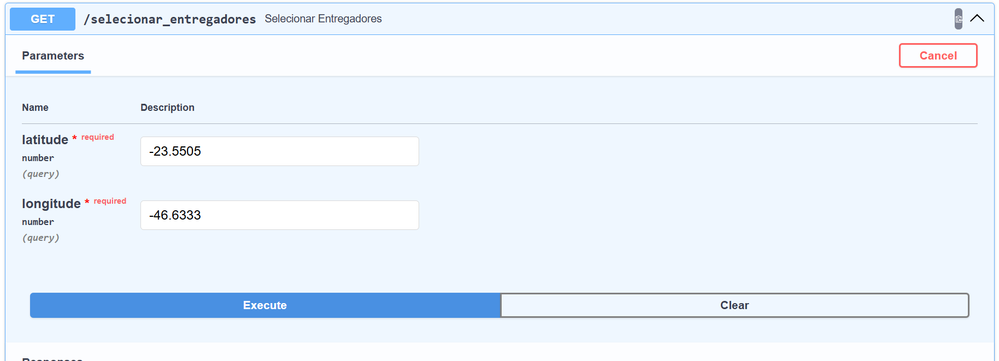<br>
  <sup>Fonte: Rappitors</sup>
</div>

<div align="center">
  <sub>Figura x: GET/selecionar_entregadores</sub><br>
  <br>
  <sup>Fonte: Rappitors</sup>
</div>
